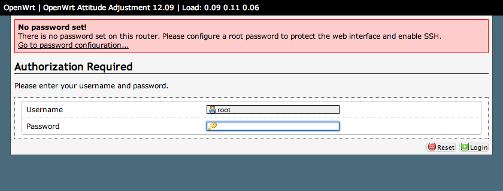
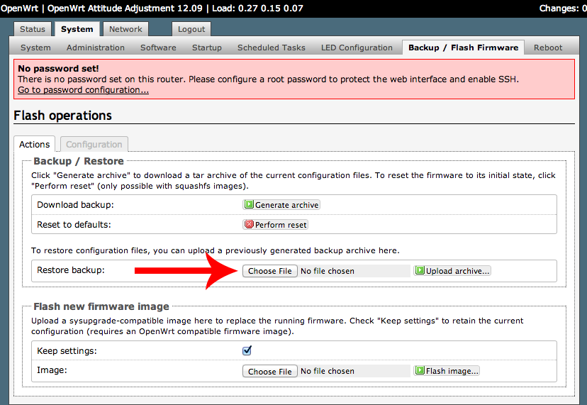
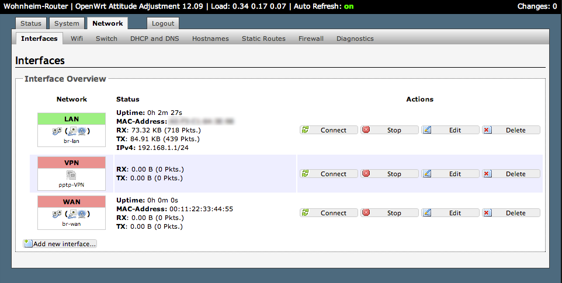
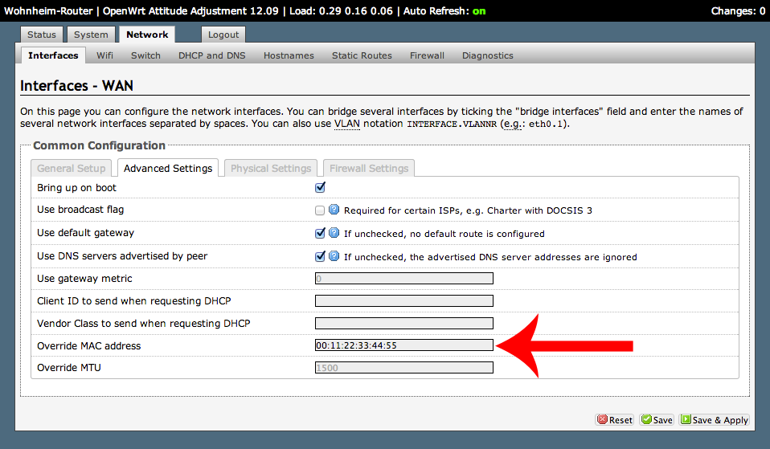
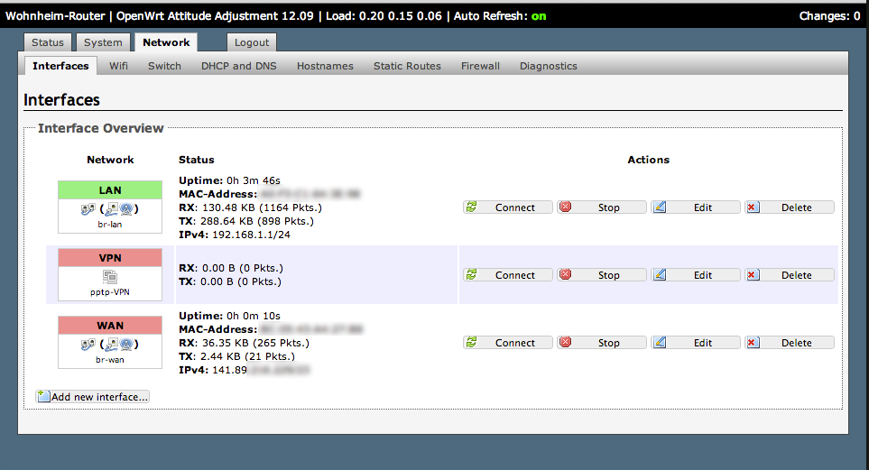
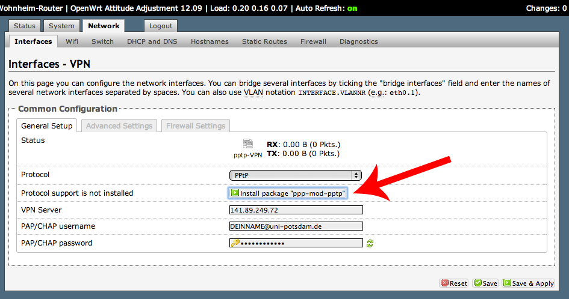
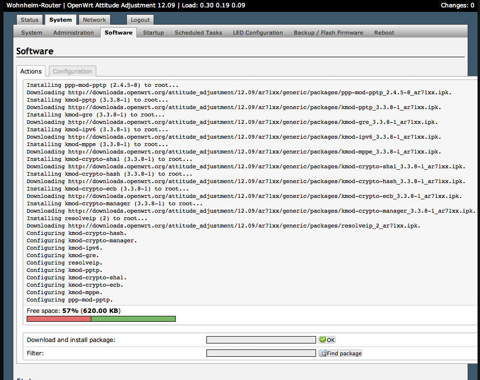
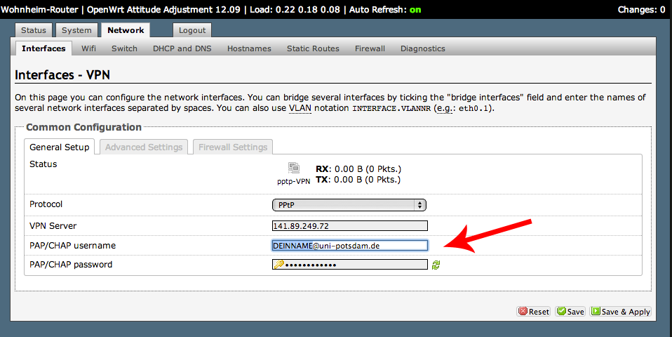
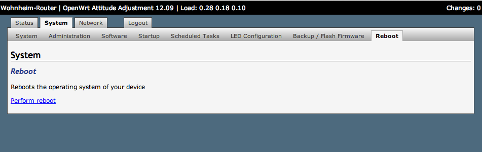
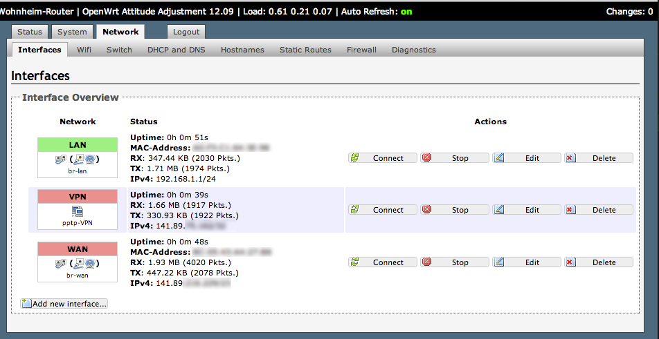

WohnheimRouter
=============
[](https://travis-ci.org/fniephaus/WohnheimRouter)

**HINWEIS:** *Ich beantworte keine Fragen und helfen nicht bei Problemen. Mit openWRT könnt ihr euren Router zerstören, deshalb lest die Anleitung sorgfältig und führt die nächsten Schritte nur dann aus, wenn ihr wisst, was ihr tut. Für eventuelle Schäden ist jeder selber verantwortlich.*

Diese Anleitung bezieht sich zwar nur auf einen [TP-Link TL-WR841N WLAN-Router](http://www.amazon.de/dp/B001FWYGJS) (<20 Euro auf Amazon), das Vorgehen ab Schritt 4 wird aber bei anderen openWRT-fähigen Routern mit openWRT 12.09 sehr ähnlich sein. Das richtige openWRT Image müsst ihr euch in diesem Fall aber selber suchen.
Zunächste muss die Software des Routers mit openWRT ersetzt werden, dann könnt ihr die Konfigurationen einfach mit der beigefügten Datei überschreiben und anschließend MAC-Adresse und VPN-Logins an den richtigen Stellen eintragen. Fertig.
Ein paar Screenshots findet ihr beiliegend.

**Auf der Unterseite des Gerätes findet ihr die Versionsnummer. Diese Anleitung beschreibt das Vorgehen für [v8.x](#anleitung8) und [v9.x](#anleitung9).**

# Inhalt

* **[Anleitung für den TL-WR841N v8.x](#anleitung8)**
* **[Anleitung für den TL-WR841N v9.x](#anleitung9)**
* **[Mehr Informationen](#info)**
* **[Troubleshooting](#troubleshooting)**
* **[Anmerkungen](#anmerkungen)**
* **[Mithelfen](#mithelfen)**
* **[Credits](#credits)**


## <a name="anleitung8"></a>Anleitung für den TL-WR841N v8.x
0. Verbinde Router und Computer mit einem LAN-Kabel per LAN Port 1 und stelle sicher, das der WAN Port noch nicht mit deiner LAN-Buchse verbunden ist!

1. In diesem Paket befindet sich eine Datei mit dem Namen "[openwrt-ar71xx-generic-tl-wr841n-v8-squashfs-factory.bin](../raw/master/firmwares/openwrt-ar71xx-generic-tl-wr841n-v8-squashfs-factory.bin)". Mithilfe dieser Datei kannst du die Software des Routers mit openWRT ersetzen.

2. Logge dich auf deinem Router unter http://192.168.0.1/ ein und lade diese Datei als Update über das Webinterface des Routers hoch.

3. Nun wird die Firmware des Routers mit openWRT überschrieben. Keine Kabel ziehen, sondern warten!

4. Der Router sollte anschließend unter http://192.168.1.1/ erreichbar sein.


5. Nun musst du die Konfigurationen mithilfe der [WohnheimRestore.tar.gz](../raw/master/WohnheimRestore.tar.gz) Datei zurücksetzen.


6. Danach startet der Router neu und ein neues WLAN mit dem Namen "WohnheimWLAN" sollte zu finden sein.
7. Ab jetzt kann auch per WLAN Verbindung weitergearbeitet. Der WLAN-Schlüssel lautet "8149281485068231".

8. Jetzt geht's du wieder auf die openWRT Oberfläche. Der Port sollte sich allerdings geändert haben: http://192.168.1.1:8080/. Passwort lautet "Wohnheim".

9. Unter "Network" klickst du nun auf "Edit" in der WAN Zeile.


10. Dort trägst du die MAC-Adresse ein, die du Zeik mitgeteilt hast, und klickst auf "Save & Apply".


11. Erst jetzt verbindest du die WAN-Buchse mit der LAN-Box in deinem Zimmer.

12. Der Router sollte dann eine IP-Adresse per DHCP zugewiesen bekommen.


13. Hat das alles soweit geklappt, kannst du nun auf "Edit" in der VPN Zeile gehen und deine Zeik Login-Daten ergänzen. Dazu muss allerdings vorher das "ppp-mod-pptp" Paket installiert werden. Dazu klickst du auf "Install package 'ppp-mod-pptp'" und dann musst du die Paketliste aktualisieren und nochmal auf "Install package 'ppp-mod-pptp'" klicken.




14. Wenn du das alles erledigt hast, startest du den Router unter "System" -> "Reboot" neu.


15. Jetzt sollte auch die VPN Schnittstelle eine IP zugewiesen bekommen.


16. Ab jetzt wird der gesamte Traffic durch den VPN-Tunnel geleitet und du hast eine andere IP als zuvor.

17. Fertig! Du surfst jetzt ohne Portblockade!


18. Jetzt solltest du vielleicht den Name und Passwort des WLANs sowie das openWRT Admin Passwort ändern.

## <a name="anleitung9"></a>Anleitung für den TL-WR841N v9.x

TP-Link hat kürzlich eine neue Hardwarerevision veröffentlich, auf welcher die alte Firmware leider nicht mehr läuft.
Es gibt mittlerweile aber auch eine Firmware für das neue Gerät, die soweit ich das beurteilen kann, stabil läuft. Außerdem bietet diese eine neue Benutzeroberfläche an, die auf [Bootstrap](http://getbootstrap.com/) basiert.

Das Vorgehen ist ähnlich wie vorher. Es muss allerdings folgende Datei als Update auf den Router geladen werden:
[openwrt-ar71xx-generic-tl-wr841n-v9-squashfs-factory.bin](../raw/master/firmwares/openwrt-ar71xx-generic-tl-wr841n-v9-squashfs-factory.bin)

Anschließend sollte der Router unter http://192.168.1.1 erreichbar sein.

Die `WohnheimRestore.tar.gz` Datei ist nicht kompatibel mit der neuen Firmware, deswegen sollte man folgende Schritte manuell ausführen:

1. Die MAC-Adresse des WAN-Ports überschreiben und erst danach das Kabel verbinden

2. Ein VPN Interface mit PPtP anlegen und deine Logins eintragen

3. Andere Einstellungen vornehmen, wie WLAN Name/Passwort, Portforwards wenn man will etc...

Hier die VPN-Details nochmal:

```
VPN-Server: vpn.uni-potsdam.de
PAP/CHAP username: deinname@uni-potsdam.de
PAP/CHAP password: *Dein Passwort*
```
## <a name="info"></a>Mehr Informationen
Mehr Informationen zu openWRT für den TP-Link TL-WR841N WLAN Router finden sich unter:
http://wiki.openwrt.org/toh/tp-link/tl-wr841nd

## <a name="troubleshooting"></a>Troubleshooting

1. Hin und wieder bricht die Internetverbindung zusammen. Ist das normal?
Ja, das ist es. Manchmal wird die VPN-Verbindung aus irgendeinem Grund einfach getrennt. openWRT sollte die Verbindung dann aber wieder selbstständig aufbauen. Bei mir kommt das etwa einmal pro Monat vor.

2. Ich bekomme es irgendwie nicht hin. Was kann ich tun?
Frag in der [Wohnheimgruppe](https://www.facebook.com/notes/wohnanlage-potsdam-stahnsdorfer-stra%C3%9Fe/anleitung-wohnheim-router/529979927078271) um Hilfe. Du wirst sicher nicht der Erste sein.


## <a name="anmerkungen"></a>Anmerkungen


### Firmware v8.0
Die Firmware-Datei [openwrt-ar71xx-generic-tl-wr841n-v8-squashfs-factory.bin](../raw/master/firmwares/openwrt-ar71xx-generic-tl-wr841n-v8-squashfs-factory.bin) enthält openWRT 14.07 und stammt aus dem offiziellen [openWRT Download Bereich](http://downloads.openwrt.org/barrier_breaker/14.07/ar71xx/generic/).

### Firmware v9.0
Die Firmware-Datei [openwrt-ar71xx-generic-tl-wr841n-v9-squashfs-factory.bin](../raw/master/firmwares/openwrt-ar71xx-generic-tl-wr841n-v9-squashfs-factory.bin) enthält openWRT 14.07 und stammt aus dem offiziellen [openWRT Download Bereich](http://downloads.openwrt.org/barrier_breaker/14.07/ar71xx/generic/).


Die Firmware-Datei [openwrt-ar71xx-generic-tl-wr841n-v9-squashfs-factory-latest.bin](../raw/master/firmwares/openwrt-ar71xx-generic-tl-wr841n-v9-squashfs-factory-latest.bin) wird von [Travis CI](https://travis-ci.org/fniephaus/WohnheimRouter) mit dem [openWRT Image Builder](http://wiki.openwrt.org/doc/howto/obtain.firmware.generate) automatisch gebaut und ist deshalb neuer als die andere Firmware für v9.x, aber nicht getestet. Wer es sich zutraut, kann sie vorsichtig ausprobieren!

Zum Selberbauen kann man unter Linux folgendes ausführen:
```bash
cd ~
mkdir openwrt && cd openwrt
wget http://downloads.openwrt.org/snapshots/trunk/ar71xx/OpenWrt-ImageBuilder-ar71xx_generic-for-linux-x86_64.tar.bz2
tar -xvjf OpenWrt-ImageBuilder-ar71xx_generic-for-linux-x86_64.tar.bz2
cd OpenWrt-ImageBuilder-ar71xx_generic-for-linux-x86_64
make image PROFILE=TLWR841 PACKAGES="base-files busybox dnsmasq dropbear firewall fstools hostapd-common ip6tables iptables iw iwinfo jshn kernel kmod-ath kmod-ath9k kmod-ath9k-common kmod-cfg80211 kmod-crypto-aes kmod-crypto-arc4 kmod-crypto-core kmod-crypto-ecb kmod-crypto-hash kmod-crypto-manager kmod-crypto-pcompress kmod-crypto-sha1 kmod-gpio-button-hotplug kmod-gre kmod-ip6tables kmod-ipt-conntrack kmod-ipt-core kmod-ipt-nat kmod-ipt-nathelper kmod-iptunnel kmod-ipv6 kmod-ledtrig-usbdev kmod-lib-crc-ccitt kmod-mac80211 kmod-mppe kmod-nls-base kmod-ppp kmod-pppoe kmod-pppox kmod-pptp kmod-slhc kmod-usb-core kmod-usb-ohci kmod-usb2 libblobmsg-json libc libgcc libip4tc libip6tc libiwinfo libiwinfo-lua libjson-c libjson-script liblua libnl-tiny libubox libubus libubus-lua libuci libuci-lua libxtables lua luci luci-app-firewall luci-i18n-english luci-lib-core luci-lib-ipkg luci-lib-nixio luci-lib-sys luci-lib-web luci-mod-admin-core luci-mod-admin-full luci-proto-core luci-proto-ppp luci-sgi-cgi luci-theme-base luci-theme-bootstrap mtd netifd odhcp6c odhcpd opkg ppp ppp-mod-pppoe ppp-mod-pptp procd resolveip swconfig uboot-envtools ubox ubus ubusd uci uhttpd uhttpd-mod-ubus wpad-mini"

```

## <a name="mithelfen"></a>Mithelfen
Es kann durchaus sein, dass die Anleitung an manchen Stellen unvollständig oder etwas zu technisch ist. Gerne kannst du das [Repository forken](https://help.github.com/articles/fork-a-repo) und dann mit einem [Pull-Request](https://help.github.com/articles/using-pull-requests) Verbesserungen und Ergänzungen einreichen!


## <a name="credits"></a>Credits
An dieser Stelle ein Dank an die [openWRT Community](https://openwrt.org/) für das Bereitstellen einer alternativen Firmware, mit der man das volle Potential des Routers ausschöpfen kann.
